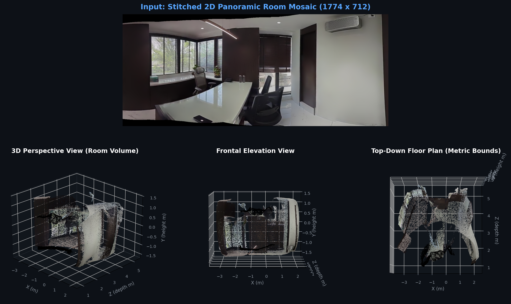
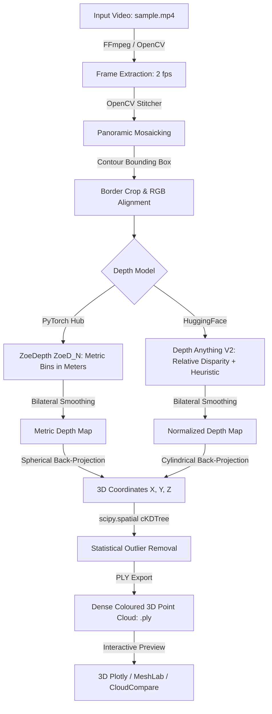

# 2D-to-3D: Monocular Panoramic Indoor 3D Reconstruction

<div align="center">

[](https://www.python.org/)
[](https://pytorch.org/)
[](https://huggingface.co/)
[](https://opencv.org/)
[](LICENSE)
[](https://colab.research.google.com/)

**A Comparative Study of Relative (*Depth Anything V2*) vs. Metric (*ZoeDepth*) Depth Estimation for Video-Based Indoor 3D Reconstruction**

*Indian Institute of Technology (Indian School of Mines), Dhanbad*

</div>

---

## 📌 Overview

Recovering accurate 3D geometry from casual hand-held video is a fundamental challenge in computer vision. Traditional Structure-from-Motion (SfM) pipelines often degrade or fail completely on indoor scenes characterized by low-texture planar surfaces (plain walls, uniform floors, ceilings). 

This repository presents an end-to-end pipeline that transforms a short, casual panoramic video of an indoor room (`sample.mp4`) into a dense, metric 3D point cloud (`.ply`) without requiring multi-camera rigs or dense depth sensors.

We investigate and contrast two monocular depth estimation paradigms:
1. **ZoeDepth (`ZoeD_N`)**: A metric depth transformer with adaptive metric bins trained on indoor ground-truth data (NYU Depth v2), producing coordinates physically grounded in **metres**.
2. **Depth Anything V2 (`ViT-S`)**: A state-of-the-art relative depth transformer relying on scale-and-shift-invariant representations, augmented with a percentile-based scale heuristic.

---

## 🌟 Visual Results: 3D Point Cloud Glimpse

<div align="center">
  
  <p><em><strong>Top:</strong> Input stitched 2D panoramic room mosaic (1774 × 712). <strong>Bottom:</strong> Multi-view 3D projections in physical metric space (Perspective 3D room volume, Frontal elevation, and Top-Down floor plan with true scale in metres).</em></p>
</div>

### 📊 Metric Geometry Properties (`room_zoedepth.ply`)
- **Total Reconstructed 3D Points**: **907,311 vertices** with dense RGB color attributes.
- **Physical Room Width ($X$)**: $-3.32\text{ m} \to +2.16\text{ m}$ (**$\approx 5.48\text{ metres}$** wide).
- **Physical Room Depth ($Z$)**: $+0.88\text{ m} \to +5.28\text{ m}$ (**$\approx 4.40\text{ metres}$** deep).
- **Physical Room Height ($Y$)**: $-1.34\text{ m} \to +1.51\text{ m}$ (**$\approx 2.85\text{ metres}$** floor-to-ceiling).
- **Scale Grounding**: Metric physical units (metres), fine-tuned on NYU Depth v2.

---

## 🏛️ Pipeline Architecture

Both methods follow a unified, single-shot panoramic back-projection workflow:



### Key Stages:
1. **Frame Extraction**: Extracts frames from the panoramic video sweep at an optimal rate (2 fps) to balance image overlap and stitching performance.
2. **Feature Matching & Panoramic Stitching**: Computes invariant keypoints, homographies, and multi-band blending using OpenCV's `Stitcher` to construct an ultra-wide field of view.
3. **Black Border Rectification**: Automatically detects and crops irregular non-image borders resulting from homography warps.
4. **Monocular Depth Inference**: Predicts dense per-pixel depth from the stitched panorama.
5. **Noise Filtering**: Bilateral filtering preserves depth discontinuities along wall boundaries while attenuating high-frequency noise from window blinds and reflective surfaces.
6. **3D Back-Projection**: Transforms 2D image coordinates and depth predictions into 3D Cartesian coordinates $(X, Y, Z)$.
7. **Statistical Outlier Rejection**: Employs a $k$-d tree nearest-neighbor distance filter to prune sensor noise, flying pixels, and edge artifacts.
8. **Export & Visualization**: Exports dense colored point clouds in Stanford PLY format for inspection in MeshLab, CloudCompare, Blender, or interactive Plotly.

---

## 🔬 Comparative Analysis: Relative vs. Metric

| Property | Depth Anything V2 (`ViT-S`) | ZoeDepth (`ZoeD_N`) |
| :--- | :--- | :--- |
| **Prediction Quantity** | Inverse disparity (relative, unit-free) | **Metric depth in metres ($m$)** |
| **Scale Source** | Percentile clipping & fixed linear mapping ($[1, 6]$ units) | Learned metric bins module fine-tuned on NYUv2 |
| **Depth Constraint** | Unconstrained scale-and-shift invariant loss | Log-binomial distribution over adaptive bin centres |
| **Cross-Scene Scale Consistency** | ❌ No (different rooms map to identical arbitrary scale) | ✅ **Yes (physical metres preserved across scenes)** |
| **Projection Model** | Cylindrical coordinate mapping | Spherical $(\theta, \phi)$ coordinate mapping |
| **Point Cloud Points (Benchmark)** | ~180,000 points | **298,642 points** (from 315,772 initial) |
| **Outlier Filter Tuning** | $k=21$, $\text{thresh} = \mu + 2.0\sigma$ | $k=31$, $\text{thresh} = \mu + 1.5\sigma$ |
| **Best Used For** | Fast previews, visual effects, relative relief | **Robotics, CAD/BIM, floor plans, real measurement** |

> **Conclusion**: While Depth Anything V2 produces clean relative surface layouts, its scale is arbitrary and scene-dependent. ZoeDepth produces **metrically faithful point clouds** suitable for downstream measurement, robotics, and architectural spatial planning.

---

## 📐 Mathematical Formulation

### 1. ZoeDepth Spherical Back-Projection
For an image of dimensions $W \times H$ with horizontal field-of-view $\text{FOV}_x$:

$$\text{FOV}_y = \text{FOV}_x \cdot \frac{H}{W}$$

$$\theta(u) = \left(\frac{u}{W} - 0.5\right) \cdot \text{FOV}_x, \quad \phi(v) = \left(\frac{v}{H} - 0.5\right) \cdot \text{FOV}_y$$

Given metric depth $d(u, v)$ in metres:

$$X = d(u, v) \cdot \sin\theta \cdot \cos\phi$$

$$Y = -d(u, v) \cdot \sin\phi$$

$$Z = d(u, v) \cdot \cos\theta \cdot \cos\phi$$

### 2. Statistical Outlier Removal
For each 3D point $p_i$, we query its $k$ nearest neighbors using a $k$-d tree:

$$\bar{d}_i = \frac{1}{k-1} \sum_{j=1}^{k-1} \|p_i - p_{i,j}\|_2$$

Points are filtered according to global distance statistics:

$$\text{Keep } p_i \iff \bar{d}_i < \mu_{\bar{d}} + \alpha \cdot \sigma_{\bar{d}}$$

Where $\alpha = 1.5$ for ZoeDepth and $\alpha = 2.0$ for Depth Anything V2.

---

## 📁 Repository Structure

```text
2dto3d/
├── .gitignore                       # Git ignore rules for virtual environments & build artifacts
├── README.md                        # Primary project documentation and usage guide
├── PAPER.md                         # Complete academic paper in GitHub Markdown
├── depth-estimation-comparison.docx # Original research paper manuscript (.docx)
├── requirements.txt                 # Python dependencies
├── pipeline.py                      # Standalone CLI 3D reconstruction pipeline
├── assets/                          # Showcase graphics & figures
│   ├── reconstruction_showcase.png  # Multi-view composite reconstruction graphic
│   └── stitched_panorama.jpg        # Extracted 2D panoramic mosaic
├── zoedepth.ipynb                   # Colab/Jupyter notebook: ZoeDepth metric pipeline
├── depth.ipynb                      # Colab/Jupyter notebook: Depth Anything V2 pipeline
├── room_zoedepth.ply                # Reconstructed metric 3D point cloud (~907k vertices)
└── sample.mp4                       # Sample indoor panoramic room video (~3.9 MB)
```

---

## 🚀 Quickstart & Installation

### 1. Clone the Repository
```bash
git clone https://github.com/La-Talia/Panaroma-Video-to-3D-Point-Cloud.git
cd Panaroma-Video-to-3D-Point-Cloud
```

### 2. Create Virtual Environment
```bash
# Using venv
python -m venv venv

# Activate (Windows PowerShell)
venv\Scripts\Activate.ps1

# Activate (Linux / macOS)
source venv/bin/activate
```

### 3. Install Dependencies
```bash
pip install --upgrade pip
pip install -r requirements.txt
```

> **Note on PyTorch & ZoeDepth**: For GPU acceleration, ensure your PyTorch build matches your CUDA version (e.g. `pip install torch torchvision --index-url https://download.pytorch.org/whl/cu121`). ZoeDepth requires `timm==0.6.7` (already pinned in `requirements.txt`).

---

## 💻 How to Run

### Method A: Standalone CLI Script (`pipeline.py`)

Run the full end-to-end reconstruction from your terminal:

```bash
# 1. Run ZoeDepth metric reconstruction (default, output: room_zoedepth.ply)
python pipeline.py --video sample.mp4 --model zoedepth --output room_zoedepth.ply

# 2. Run Depth Anything V2 relative reconstruction
python pipeline.py --video sample.mp4 --model depth_anything --output room_depth_anything.ply

# 3. Reconstruct directly from an existing stitched panorama image
python pipeline.py --image my_panorama.jpg --model zoedepth --stride 1 --output dense_room.ply

# 4. Generate an interactive 3D HTML visualization
python pipeline.py --video sample.mp4 --model zoedepth --save_html preview.html
```

#### CLI Options Reference
- `--video <path>`: Path to input sweeping video (default: `sample.mp4`).
- `--image <path>`: Path to pre-stitched panorama (skips video extraction & stitching).
- `--model {zoedepth, depth_anything}`: Depth estimation engine (default: `zoedepth`).
- `--fps <float>`: Frame extraction rate (default: `2.0`).
- `--stride <int>`: Point cloud grid stride. Set to `1` for full resolution, `2` for balanced density, `3-4` for lightweight clouds.
- `--output <path>`: Output PLY filepath.
- `--preview`: Launches an interactive 3D scatter plot in your browser.
- `--save_html <path>`: Exports interactive 3D Plotly visualization to a standalone HTML file.

---

### Method B: Interactive Jupyter / Google Colab Notebooks

Both notebooks are fully configured and work out-of-the-box locally and on Google Colab:

- **`zoedepth.ipynb`**: Demonstrates the ZoeDepth metric pipeline, NYUv2 fine-tuning inference, spherical back-projection, and an interactive embedded Plotly 3D scatter plot.
- **`depth.ipynb`**: Demonstrates the Depth Anything V2 pipeline, inverse disparity clipping heuristic, and cylindrical back-projection.

To open in Google Colab:
1. Upload `zoedepth.ipynb` or `depth.ipynb` to [Google Colab](https://colab.research.google.com/).
2. Enable GPU acceleration under **Runtime > Change runtime type > T4 GPU**.
3. Run all cells. If `sample.mp4` is present in the session, it processes immediately; otherwise, a file upload prompt will appear.

---

## 👓 Viewing 3D Point Clouds

The generated `.ply` files can be opened in any standard 3D viewer:

1. **[MeshLab](https://www.meshlab.net/)** *(Recommended)*:
   - File > Import Mesh > Select `room_zoedepth.ply`.
   - Toggle vertex colors on the top toolbar (`Color > Per Vertex`).
2. **[CloudCompare](https://www.danielgm.net/cc/)**:
   - Outstanding for inspecting point distributions and measuring real-world distances in metres.
3. **[Blender](https://www.blender.org/)**:
   - Import via `File > Import > Stanford (.ply)`.
4. **Interactive Plotly**:
   - Previews directly inside the notebook or via `python pipeline.py --preview`.

---

## 📄 Academic Paper

The accompanying paper detailing this research is included in both Word and Markdown formats:
- 📄 **Markdown**: [PAPER.md](PAPER.md)
- 📝 **Word Document**: [depth-estimation-comparison.docx](depth-estimation-comparison.docx)

### Citation
```bibtex
@article{rax2026depthcomparison,
  title={A Comparative Study of Relative and Metric Monocular Depth Estimation for Video-Based Indoor 3D Reconstruction},
  author={Rax},
  affiliation={Department of Computer Vision and 3D Reconstruction, Indian Institute of Technology (Indian School of Mines), Dhanbad},
  year={2026},
  month={September}
}
```

---
